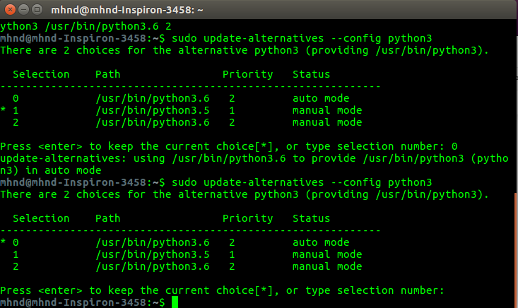

# 1. Apa itu Raspberry Pi?

**`Raspberry Pi`** merupakan salah satu jenis komputer mini (mini-PC) yang sering digunakan untuk pembelajaran pemograman sistem tertanam di sekolah ataupun universitas. Raspberry Pi juga sering digunakan pada kasus jaringan, [IoT (Internet of Things)](https://id.wikipedia.org/wiki/Internet_untuk_Segala), dan [Robotika](https://en.wikipedia.org/wiki/Robot) dengan keunggulannya yang berbentuk mini. Dengan fitur yang lengkap, memungkinkan mini-PC ini mudah terhubung dengan beberapa perangkat lainnya seperti [Arduino](http://arduno.cc), Android, maupun web server. Selain itu, Raspberry Pi ini juga sudah mendukung [ROS (Robot Operating System)](http://wiki.ros.org/) sebagai perpustakaan dan alat untuk kontrol robot lanjutan. Untuk referensi tentang Raspberry lebih lanjut, klik di [Wikipedia Reference](https://en.wikipedia.org/wiki/Raspberry_Pi#Model_B).


## Raspberry Pi 3b+

Versi berapa kah Raspberry Pi yang kita akan gunakan? Yups, untuk mengetahuinya, dapat kita lihat pada papan Raspberry Pi bagian atas. Disitu sudah dituliskan jenis dan tahun pembuatannya. Atau kurang lebih akan tampak pada gambar dibawah ini:


[Gambar dari www.raspberrypi.org](https://www.raspberrypi.org/products/raspberry-pi-3-model-b-plus/)

---

## Jenis dan Spesifikasinya 

Raspberry Pi 3b+ merupakan produk termuhtakhir dari jenis Raspberry Pi 3. Jenis ini memiliki spesifikasi sebagai berikut:

+ Broadcom BCM2837B0, Cortex-A53 (ARMv8) 64-bit SoC @ 1.4GHz 
+ 1GB LPDDR2 SDRAM
+ 2.4GHz and 5GHz IEEE 802.11.b/g/n/ac wireless LAN, Bluetooth 4.2, BLE
+ Gigabit Ethernet over USB 2.0 (maximum throughput 300 Mbps)
+ Extended 40-pin GPIO header
+ Full-size HDMI
+ 4 USB 2.0 ports
+ CSI camera port for connecting a Raspberry Pi camera
+ DSI display port for connecting a Raspberry Pi touchscreen display
+ 4-pole stereo output and composite video port
+ Micro SD port for loading your operating system and storing data
+ 5V/2.5A DC power input
+ Power-over-Ethernet (PoE) support (requires separate PoE HAT)

atau apabila kita komparasi dengan beberapa jenis Raspberry Pi lainnya:

[Sumber](https://image.ibb.co/bweuCz/Specifications.png)

Untuk pembaruan tipe Raspberry Pi 4 Model B, memiliki spesifikasi seperti berikut ini:

+ Broadcom BCM2711, Quad core Cortex-A72 (ARM v8) 64-bit SoC @ 1.5GHz
+ 1GB, 2GB or 4GB LPDDR4-3200 SDRAM (depending on model)
+ 2.4 GHz and 5.0 GHz IEEE 802.11ac wireless, Bluetooth 5.0, BLE
+ Gigabit Ethernet
+ 2 USB 3.0 ports; 2 USB 2.0 ports.
+ Raspberry Pi standard 40 pin GPIO header (fully backwards compatible with previous boards)
+ 2 × micro-HDMI ports (up to 4kp60 supported)
+ 2-lane MIPI DSI display port
+ 2-lane MIPI CSI camera port
+ 4-pole stereo audio and composite video port
+ H.265 (4kp60 decode), H264 (1080p60 decode, 1080p30 encode)
+ OpenGL ES 3.0 graphics
+ Micro-SD card slot for loading operating system and data storage
+ 5V DC via USB-C connector (minimum 3A*)
+ 5V DC via GPIO header (minimum 3A*)
+ Power over Ethernet (PoE) enabled (requires separate PoE HAT)
+ Operating temperature: 0 – 50 degrees C ambient

+ * A good quality 2.5A power supply can be used if downstream USB peripherals consume less than 500mA in total.

[Sumber](https://www.raspberrypi.org/products/raspberry-pi-4-model-b/specifications/)

lalu, berapa harga kisaran sebuah Raspberry Pi yang dijual dipasaran? (estimasi harga dari website resmi)

- Raspberry Pi 1, Model A & Model B (2012, discontinued)
- [Raspberry Pi 1, Model B+](https://www.raspberrypi.org/products/raspberry-pi-1-model-b-plus/) (July, 2014)
- [Raspberry Pi 1, Model A+](https://www.raspberrypi.org/products/raspberry-pi-1-model-a-plus/) (November, 2014)
- [Raspberry Pi 2, Model B](https://www.raspberrypi.org/products/raspberry-pi-2-model-b/) (February, 2015)
- [Raspberry Pi Zero](https://www.raspberrypi.org/products/raspberry-pi-zero/) (November, 2015)
- [Raspberry Pi 3, Model B](https://www.raspberrypi.org/products/raspberry-pi-3-model-b/) (March, 2016)
- [Raspberry Pi Zero W](https://www.raspberrypi.org/products/raspberry-pi-zero-w/) (February, 2017)
- [Raspberry Pi 3, Model B+](https://www.raspberrypi.org/products/raspberry-pi-3-model-b-plus/) (March, 2018)
- [Raspberry Pi 3, Model A+](https://www.raspberrypi.org/products/raspberry-pi-3-model-a-plus/) (November, 2018)
- [Raspberry Pi 4, Model B](https://www.raspberrypi.org/products/raspberry-pi-4-model-b) (June, 2019)


Bagi Anda ingin mengembangakan Raspberry Pi lebih lanjut, berikut beberapa referensi lanjutan:

+ [Schematic Raspberry Pi 3B+](https://www.raspberrypi.org/documentation/hardware/raspberrypi/schematics/rpi_SCH_3bplus_1p0_reduced.pdf)
+ [Mechanical Drawing (Board)](https://www.raspberrypi.org/documentation/hardware/raspberrypi/mechanical/rpi_MECH_3bplus.pdf)
+ [Mechanical Drawing (Case)](https://www.raspberrypi.org/documentation/hardware/raspberrypi/mechanical/rpi_MECH_3bplus_case.pdf)
+ [Basic Guides to Configuring Raspberry Pi](https://github.com/raspberrypi/documentation/tree/master/configuration)
+ [Techincal FAQ](https://github.com/raspberrypi/documentation/tree/master/faqs)

---

## Konfigurasi Pin dan Modul Perangkat Keras

GPIO (General Purpose Input/Output) pin merupakan sebuah fitur dari Raspberry Pi untuk melakukan interaksi dengan perangkat-perangkat lainnya diluar Raspberry Pi. Semisal kita ingin menyala-matikan sebuah lampu LED, kita dapat menggunakan pin `GPIO` untuk memberikan perintah atau isyarat kepada rangkaian kontrol lampu LED. Perintah atau isyarat tersebut biasaya dituliskan pada sebuah program dengan bahasa Python dengan menggunakan pustaka `RPi.GPIO` yang dapat dengan mudah diunduh menggunakan perintah `pip install RPi.GPIO` pada terminal Linux OS based yang digunakan pada Raspberry Pi kalian. 

Perangkat keras Raspberry Pi 3b+ merupakan fitur-fitur pendukung Raspberry Pi yang dapat digunakan atau tidak atau sesuai kebutuhan penggunannya. Fitur tersebut dapat digunakan dengan menghubungkan perangkat tambahan sesuai dengan jenis peghubungnya. Semisal untuk 4xUSB yang tersedia, dapat dihubungkan dengan USB Keyboard dan USB Mouse sebagai perangkat masukan pada sistem operasi didalamnya. Atau CSI camera port yang digunakan untuk menghubungkan Raspberry Pi camera yang dijual terpisah. Namun kita juga bisa menggunakan USB Webcam untuk mengganti Raspberry Pi camera untuk kebutuhan kita. Oleh karenanya, penggunaan fitur-fitur yang tersedia tidaklah harus kesemuanya disediakan dan digunakan. **Bergantung pada kebutuhan kita.** 

**Akan tetapi**, ada satu yang perlu dan harus kita butuhkan agar Raspberry Pi kita dapat bekerja, yaitu catu daya. Ya, catu daya yang dibutuhkan adalah `5V/2.5A DC` dengan port `universal micro USB`, atau apabila kalian kesusahan untuk mencari sumber catu dayanya, kalian dapat menggunakan `charger smartphone` kalian. :D


---


# 2. Sistem Operasi pendukung Raspberry Pi

Ada banyak sistem operasi pendukung Raspberry Pi yang bergantung pada kebutuhannya masing-masing. Pada umumnya, sistem operasi Raspberry Pi yang digunakan adalah `Raspbian`, yaitu sistem operasi resmi berbasis Debian. Untuk sistem operasi lainnya yang sering digunakan yang berbasis Ubuntu, dapat menggunakan `Ubuntu MATE`. Ketika kita tidak menggunakan sistem operasi yang resmi, kita menyalahi aturan penggunaan Raspberry Pi. Kebanyakan sumber yang digunakan pada Rapberry Pi bersifat `Creative Common` atau `open-source` yang memungkinkan kita dapat merubah dan mengembangkan sesuai kebutuhan kita sesuai keinginan kita. Yups, sama halnya dengan sistem operasi Linux based, yang open-source. `Kita bisa memodifikasi sesuai keinginan kita. :D`

Berikut adalah daftar sistem operasi yang mendukung Raspberry Pi :


- [Raspbian](https://www.raspberrypi.org/downloads/raspbian/) - The official supported Raspberry Pi OS, based on Debian and available as a lite version.
- [NOOBS](https://www.raspberrypi.org/downloads/noobs/) - New Out Of the Box Software, an easy OS installer for beginners.
- [Ubuntu MATE](https://ubuntu-mate.org/raspberry-pi/) - Ubuntu distribution for the Raspberry Pi based on MATE desktop. `Supports Raspberry Pi 2+`
- [Snappy Ubuntu Core](https://developer.ubuntu.com/core/get-started/raspberry-pi-2-3) - Official (minimal) Ubuntu distribution for IoT. `Supports Raspberry Pi 2+`
- [Windows 10 IoT Core](https://docs.microsoft.com/nl-nl/windows/iot-core/downloads) - Windows 10 distribution for IoT. `Supports Raspberry Pi 2+`
- [OSMC](https://osmc.tv/) - Open Source Media Centre, based on Kodi.
- [PiNet](http://pinet.org.uk/) - System to manage Raspberry Pi classrooms.
- [Risc OS](https://www.riscosopen.org/content/downloads/raspberry-pi) - Non-Linux OS originated from the group that developed the ARM microprocessor.
- [RuneAudio](http://www.runeaudio.com/) - Free and open source OS that turns embedded hardware into Hi-Fi music players.
- [OpenELEC](http://openelec.tv/) - Open Embedded Linux Entertainment Center, a very lightweight Kodi build.
- [HypriotOS](http://blog.hypriot.com/about/) - Minimal Debian-based operating system, optimized to run Docker.
- [Kali Linux](https://www.offensive-security.com/kali-linux-arm-images/) - Penetration Testing & Ethical Hacking Linux distro for ARM devices.
- [RetroPie](https://retropie.org.uk/) - Retro-gaming on the Raspberry Pi.
- [Alpine Linux](https://wiki.alpinelinux.org/wiki/Raspberry_Pi) - Security-oriented, lightweight Linux distribution based on musl libc and busybox.
- [Arch Linux ARM](https://archlinuxarm.org/) - Lightweight and flexible Linux distribution that tries to Keep It Simple.
- [Volumio](https://volumio.org/) - Headless audiophile music player, designed to play music with the highest possible fidelity.
- [Recalbox](https://www.recalbox.com) - Drag & drop light-weight retro-gaming and media center on the Raspberry Pi.
- [Lakka](http://lakka.tv) - Retro-gaming on the Raspberry Pi built entirely on RetroArch.
- [RasPlex](http://www.rasplex.com/) - Plex client for the Raspberry Pi.
- [chilipie-kiosk](https://github.com/futurice/chilipie-kiosk) - Image which boots directly into full-screen Chrome, perfect for dashboards and build monitors. `Supports Raspberry Pi 2+`
- [DietPi](https://github.com/Fourdee/DietPi) - Minimal image designed to fit on a 2GB SD card, with tons of configurable settings and scripts.
- [CentOS](https://wiki.centos.org/SpecialInterestGroup/AltArch/Arm32/RaspberryPi3) - CentOS on the Raspberry Pi. *Supports Raspberry Pi 2+*
- [Minibian](https://minibianpi.wordpress.com/) - Minimal Raspbian (lighter than Jessie Lite).
- [BerryBoot](http://www.berryterminal.com/doku.php/berryboot) - Bootloader/universal OS installer, with support to VNC and HDMI-CEC.
- [PirateBox](https://piratebox.cc/raspberry_pi:diy) - Anonymous offline mobile file-sharing and communications system.
- [OctoPi](https://octopi.octoprint.org/) - Distribution for 3d printers.
- [Kano OS](http://developers.kano.me/downloads/) - Open-source OS for exploration, creation, and play – free for Raspberry Pi and the new Pi 3.
- [balenaOS](https://www.balena.io/os/) - open source OS to run Docker containers on embedded devices that's been designed for reliability and proven in production.
- [Fedora](https://fedoraproject.org/wiki/Raspberry_Pi#Preparing_the_SD_card) - Linux Fedora distribution built for the Pi. `Supports Raspberry Pi 2+`
- [motionEyeOS](https://github.com/ccrisan/motioneyeos/wiki) - Linux distribution that turns a single-board computer into a video surveillance system.
- [NextCloudPi](https://ownyourbits.com/2017/02/13/nextcloud-ready-raspberry-pi-image/) - Nextcloud ready image based on Raspbian. Features Nextcloud 11 running on Raspbian 8, with PHP 7 and HTTP2 enabled Apache server.
- [PiDeck](http://pideck.com/) - Small form factor DVS system allowing you to control digital music files with timecode vinyl.
- [OpenWRT](https://wiki.openwrt.org/toh/raspberry_pi_foundation/raspberry_pi) - OpenWrt is described as a Linux distribution for embedded devices for network management.
- [FreeBSD](https://wiki.freebsd.org/FreeBSD/arm/Raspberry%20Pi) - FreeBSD is an advanced computer operating system used to power modern servers, desktops, and embedded platforms.
- [NetBSD](https://wiki.netbsd.org/ports/evbarm/raspberry_pi/) - NetBSD is a free, fast, secure, and highly portable Unix-like Open Source operating system.
- [Hass.io](https://home-assistant.io/hassio/installation/) - Home automation operating system/application for embedded device, also available standalone.
- [Android Things](https://developer.android.com/things/hardware/raspberrypi.html) - Build connected devices for a wide variety of consumer, retail, and industrial applications. `Supports Raspberry Pi 3`
- [Gladys Project](https://gladysproject.com/en/) - Gladys, Your home assistant. `Supports Raspberry Pi 3`
- [OpenMediaVault](https://www.openmediavault.org/) - OpenMediaVault is the next generation network attached storage (NAS) solution based on Debian Linux containing services like SSH, (S)FTP, SMB/CIFS, DAAP media server, RSync, BitTorrent client and many more. `Supports Raspberry Pi 3`
- [EZ-WifiBroadcast](https://github.com/bortek/EZ-WifiBroadcast/wiki) - Affordable Wireless Digital HD Video Transmission made easy. `Supports Raspberry Pi 3` `Supports Raspberry Pi Zero`
- [DroneBridge](https://github.com/seeul8er/DroneBridge) - A WifiBroadcast extension to make for a real alternative to DJI Lightbridge and other similar systems. `Supports Raspberry Pi 3`
- [TrueOS](https://www.trueos.org/handbook/pico.html) - FreeBSD-based thin client solution. `Supports Raspberry Pi 2+`
- [OpenHABian](https://docs.openhab.org/installation/openhabian.html) - A preconfigured version of the OpenHAB home automation software. `Supports Raspberry Pi 2+]`
- [FabScanPi](https://mariolukas.github.io/FabScanPi-Server/) - FabScanPi is an open source 3D laser scanner using the Raspberry Pi Camera Module. `Supports Raspberry Pi 2+`
- [Rocket Show](https://rocketshow.net) - Play synced backing tracks, videos and DMX light-sequences live on stage. `Supports Raspberry Pi 3`
- [SamplerBox](http://www.samplerbox.org/makeitsoftware) - Drop'n'play sampler: drop .WAV samples on the SD card, and play!
- [SARPi](http://sarpi.fatdog.nl/index.php?p=sarpi) - Stands for the Slackware ARM on Raspberry Pi.
- [Gentoo](https://wiki.gentoo.org/wiki/Raspberry_Pi) - Gentoo Stage 3 tarball for Raspberry Pi.
- [MoodleBox](https://moodlebox.net/) - The MoodleBox provides a Moodle learning management system on Raspberry Pi. `Supports Raspberry Pi 3`

# 3. Apa saja yang dapat kita lakukan dengan Raspberry Pi?

Pada bagian ini, kita akan memulai untuk membayangkan apa saja yang akan bisa kita buat dari satu papan yang berisi sistem tertanam sebesar kartu ATM. Semisal kita akan membuat sebuah [Smart TV ](https://www.hackster.io/apugog/raspberry-pi-smart-tv-d886de) yang hanya membutuhkan beberapa komponen pendukung seperti layar monitor dan kabel HDMI to VGA, atau kita juga dapat membuat sebuah sistem otomasi yang biasanya disebut [Smart Home](https://www.electromaker.io/blog/article/9-best-raspberry-pi-smart-home-software-options) untuk melakukan banyak hal pada rumah kita terutama ketika kita memiliki mobilitas tinggi dan harus mengurus rumah dari kejauhan dimana sistem ini sudah terintegrasi dengan internet. Ya, kurang lebih sistem tersebut sudah melekat dengan IoT atau [Internet of Things](https://medium.com/@paliwalmanu99/internet-of-things-raspberry-pi-home-automation-system-based-on-iot-a5862fdb4d58). 

Kadang kita sebagai penikmat kemajuan teknologi, kita tidak akan terus berdiam dalam berfikir untuk terus ber-**inovasi**. Dengan semangat itulah, mendorong kita untuk terus belajar. Akan tetapi, budaya untuk membaca kadang menjadi halangan. Belum lagi membaca artikel berbahasa Inggris. Ya, semua berawal dari terbiasa. Agar terbiasa, berawal dari memaksa. Memaksa diri sendiri untuk segera belajar. Agar kita terbiasa `Belajar` dimanapun dalam situasi apapun. Awal untuk belajar adalah `MEMBACA`. Membaca semua keadaan sekitar yang dapat kita gapai sesuai dengan porsi masing-masing. Ketika semua proses belajar sudah menjadi kebiasaan, `ILMU` yang muncul dihadapan kita, akan dengan mudah diterima. Mengambil `MAKNA` dan `KESAN` darinya (apapun itu) sebagai satu titik dimana kita sudah belajar. **Melakukan - Merasakan - Mengingat - Menprinsipkannya**. 

Oleh karenanya, sebagai bahan lanjutan yang dapat kalian lakukan sendiri, dengan kemauan sendiri, setelah selesai membaca referensi ini, ada beberapa proyek yang sudah dilakukan banyak orang sebelumnya. Untuk mempermudah pembacaan referensi berbahasa Inggris, dapat menggunakan fitur Google Translate dengan menempel alamat sebuah website pada terjemahannya. Seperti pada [tautan berikut](https://translate.google.com/translate?hl=en&sl=en&tl=id&u=https%3A%2F%2Fopensource.com%2Fresources%2Fraspberry-pi). 

Berikut beberapa daftar rujukan proyek yang dapat kalian baca:


- [Mini OONTZ](https://cdn-learn.adafruit.com/downloads/pdf/mini-oontz-3d-printed-midi-controller.pdf) - 3D printed mini MIDI controller.
- [Power Sniffing Strip](https://hackaday.com/2012/10/04/malicious-raspberry-pi-power-strip-looks-a-bit-scary/) - Enclosure in a power strip, sniffing network data.
- [Raspberry Pi Erlang Cluster](https://medium.com/@pieterjan_m/erlang-pi2-arm-cluster-vs-xeon-vm-40871d35d356#.bpao66cm8) - Erlang cluster on a Raspberry Pi 2.
- [NTP driven Nixie Clock](http://www.mjoldfield.com/atelier/2012/08/ntp-nixie.html) - Nixie Tube Clock powered by a Raspberry Pi.
- [40-node Raspberry Pi Cluster](http://hackaday.com/2014/02/17/40-node-raspi-cluster/) - Cluster aimed to be under the size of full tower desktop.
- [Raspberry PI Hadoop Cluster](http://www.widriksson.com/raspberry-pi-hadoop-cluster/) - Big Data cluster running on the Raspberry Pi.
- [Multi-Datacenter Cassandra on 32 Raspberry Pi’s](http://www.datastax.com/dev/blog/32-node-raspberry-pi-cassandra-cluster) - Showcase for the always on, fault tolerant nature of Cassandra using a Raspberry Pi cluster board.
- [Building a Ceph Cluster on Raspberry Pi](http://bryanapperson.com/blog/the-definitive-guide-ceph-cluster-on-raspberry-pi/) - Highly redundant and low power usage RADOS home storage solution.
- [Smart Mirror](https://github.com/evancohen/smart-mirror) - Voice controlled smart mirror with IoT integration. `Supports Raspberry Pi 2+`
- [Magic Mirror](http://magicmirror.builders) - The original open source modular smart mirror platform. `Supports Raspberry Pi 2+`
- [Chromebook Charger Kiosk](https://www.reddit.com/r/raspberry_pi/comments/53nj1z/chromebook_charger_kiosk_last_minute_charge_for/) - Timed charging station for students using Chromebooks at school.
- [Jasper](https://jasperproject.github.io/) - Flexible open source personal assistant.
- [Lightberry](https://lightberry.eu) - Led lighting solution dedicated for raspberry pi and your TV.
- [SecPi](https://github.com/SecPi/SecPi) - Raspberry Pi based home alarm system.
- [PiClock](https://github.com/n0bel/PiClock) - Fancy Clock built around a monitor and a Raspberry Pi.
- [Garage Door Opener](https://github.com/benjefferies/gogo-garage-opener) - Garage door opener using the [Garage Opener](https://play.google.com/store/apps/details?id=com.ionicframework.gogogarageopenerui416115&hl=en) app to control garage door.
- [Movel](https://github.com/stevelacy/movel) - Raspberry Pi car computer.
- [PiFanTuner](https://github.com/winkidney/PIFanTuner) - CPU-fan-tuner daemon, just enables your fan as necessary. `Supports Raspberry Pi 3`
- [SkyJack](https://samy.pl/skyjack/) - Take over and allow full control over any Parrot AR Drone within wireless distance.
- [Nerves Project](https://github.com/nerves-project) - Craft and deploy bulletproof embedded software in Elixir.
- [Wordpress using Docker](https://github.com/rothgar/rpi-wordpress) - Run a Wordpress site in containers with dynamic DNS.
- [Pi-hole](https://pi-hole.net/) - Black hole for internet ads.
- [Planning lunch with a Slackbot on resin.io](https://resin.io/blog/planning-lunch-with-a-slackbot-on-resin-io/) - Node.js Slackbot (lunchbot), hosted on Resin.
- [Sonus](https://github.com/evancohen/sonus) - Node.js voice control for your Pi (and everything else) with customizable offline hotword detection.
- [Sonic Pi](https://github.com/samaaron/sonic-pi) - The Live Coding Music Synth for Everyone.
- [Pi4j Project](http://pi4j.com) - Java I/O library the Raspberry Pi.
- [Harry Potter and the real life Daily Prophet](https://www.raspberrypi.org/blog/harry-potter-and-the-real-life-daily-prophet/) - Display mimicking the Daily Prophet from Harry Potter using a 7" Raspberry Pi display.
- [PiScan](http://denis.papathanasiou.org/posts/2015.05.30.post.html) - Makeshift Amazon Dash orders using a Raspberry PI + EAN scanner.
- [PiE-Ink](http://www.htxt.co.za/2017/02/07/pie-ink-is-a-raspberry-pi-name-tag-that-uses-an-e-ink-display/) - E-ink nametag display running on a Pi Zero. `Supports Raspberry Pi Zero`
- [Whispering Mirror](http://whisperingwallproject.com/whisperingmirror/) - Interactive soundart installation using the Hifiberry DAC.
- [clockOS](https://github.com/iGerli/clockOS) - simple smart desktop clock using a Raspberry Pi display.
- [Zelda Home Automation](https://www.raspberrypi.org/blog/zelda-home-automation/) - Home automation based on sound recognition from notes played on an ocarina.
- [Looper/synth/drum thing](https://github.com/otem/Raspberry-Pi-Looper-synth-drum-thing) - Sequencer/Drumpad, like Native Instruments' Maschine for the Pi.
- [Waves](https://github.com/euniceylee/waves) - Transforming the transience of the spoken word into something concrete and physical through a microphone, waveform and thermal printer.
- [DIY USB Rubber Ducky](https://hackaday.io/project/17598-diy-usb-rubber-ducky) - Raspberry Pi Zero Rubber Ducky recognized as a USB HID by just about anything with a USB port, thus allowing you to run custom scripts as if it were a keyboard. `Supports Raspberry Pi Zero`
- [Kubernetes on ARM](https://github.com/luxas/kubernetes-on-arm) - Get your ARM device up and running Kubernetes in less than ten minutes.
- [Lumos](https://www.instructables.com/id/LUMOS-Smart-Lamp-for-Better-Health/) - Smart Lamp for Better Sleep. `Supports Raspberry Pi 3 Supports Raspberry Pi Zero`
- [Vinyl Shelf Finder](https://valentingalea.github.io/vinyl-shelf-finder/) - Uses a tilt & pan laser to find a record in a record collection.
- [Building Timelapse with Resin](https://steveedson.co.uk/project-matilda/) - Remotely deploying timelapse camera using Docker, Resin, and 3G internet.
- [NALIVATOR-9000](https://github.com/fote/nalivator9000) - Robot bartender for making cocktails with Telegram-bot interface and speech synthesis on Golang.
- [Stratux](https://github.com/cyoung/stratux) - Open source ADS-B reciever which feeds weather, traffic, GPS, and AHRS data to electronic flight bag software via wifi.
- [Voice Kit](https://aiyprojects.withgoogle.com/voice) - AIY Voice Kit from Google, to build a standalone voice recognition system using the Google Assistant, or add voice recognition and natural language processing to your Raspberry Pi-based projects.
- [speed-camera](https://github.com/pageauc/speed-camera) - Object Motion Tracking uses python, openCV, USB Cam or picamera module to record speed data.
- [pi-timolo](https://github.com/pageauc/pi-timolo) - Remote Headless multi feature PiCamera Operation from Rclone Remote Storage Service and More.
- [Hearing aid prototoype](https://github.com/m-r-s/hearingaid-prototype) - A Raspberry Pi powered prototype of a hearing aid. `Supports Raspberry Pi 3`
- [RPI tempmon](https://github.com/gavinlyonsrepo/raspberrypi_tempmon) - CPU GPU temperature monitor with various functions such as LED GPIO, Graph output, email, alarm limit, notifications and logging.
- [RPi Motor Library](https://github.com/gavinlyonsrepo/RpiMotorLib) - Python 3 library to connect various motors & servos to the Pi.
- [Circle](https://github.com/rsta2/circle) - A C++ bare metal environment for Raspberry Pi.
- [Project MyHouse](https://maxoffsky.com/research-progress/project-myhouse-a-smart-dollhouse-with-gesture-recognition/) - Smart Doll House with Gesture Recognition, using Raspberry Pi 3 or Pi Zero and PSMove motion controller.
- [Skate-o-Meter](http://www.instructables.com/id/Skate-o-Meter/) - Skateboard odometer and speedometer with RFID user system.
- [Occu-Pi](https://github.com/bww/occu-pi) - Controller software for the Occu-pi, a totally awesome bathroom door sensor.
- [docsis-cable-load-monitor](https://github.com/sp4rkie/docsis-cable-load-monitor) - Tool to monitor downstream load on DOCSIS cable networks.
- [BeeMonitor](https://beemonitor.org/setup/) - Honey beehive monitoring project.
- [pi_payments](https://github.com/anshulahuja98/pi_payments) - Payment module based on RFID.
- [RaspiBolt](https://github.com/Stadicus/guides/tree/master/raspibolt) - Beginner’s Guide to ️⚡Lightning️⚡ on a Raspberry Pi.
- [RaspiBlitz](https://github.com/rootzoll/raspiblitz) - Fastest and cheapest way to get your own Lightning Node running.
- [FistBump BLE Edition](https://github.com/eliddell1/Project-Blue-Fist/blob/master/README.md) - WPA Hash Grabbing Bluetooth Peripheral / Android App.
- [Pi Image Capturer](https://github.com/rajeshkumarkhadka/Pi-Image-Capturer) - Captures images, integrated with the Google IOT Cloud Platform ecosystem.
- [Bitcoin Tracker](https://github.com/jonathanrjpereira/Bitcoin-Bar) - A Physical Dashboard that displays Bitcoin stats in real time. `Supports Raspberry Pi  Supports Raspberry Pi Zero`

# 4. Pengaturan Tampilan Raspberry Pi

Pengaturan tampilan pada Raspberry Pi ada beberapa jenis, diantaranya: menggunakan televisi lama (CRT) melalui kabel RCA atau menggunakan TRRS to RCA, HDMI, ataupun mengontrolnya menggunakan VNC viewer melalui saluran WiFi. Untuk lebih lebih detilnya, dapat dilihat pada penjelasan berikut. 

## 4.1 Menggunakan Televisi Lama (CRT)

TV lama atau TV CRT dapat digunakan sebagai tampilan dari Raspberry Pi. Penggunaan ini membutuhkan sambungan kabel RCA yaitu sambungan dengan komposisi kabel video (berwarna kuning), kanal audio kanan (berwarna merah), kanal audio kiri (berwarna putih) melalui sambungan konversi dari port TRRS. Port TRRS merupakan port 3.5 mm yang biasanya digunakan sebagai port untuk audio atau earphone pada smartphone. akan tetapi, pada komposisinya, pin mic pada port TRRS-nya diubah fungsinya sebagai jalur video. Gambar berikut menunjukkan kabel TRRS to RCA. [sumber foto](https://thepihut.com/products/av-composite-cable-3-5mm-to-3-x-rca-3m)

Sedangkan untuk kalian yang ingin membuatnya sendiri sambunga TRRS to RCA ini, kalian bisa mengikuti tutorial pembuatan sambungannya pada laman [berikut ini](https://www.instructables.com/id/Raspberry-Pi-2-Quick-n-Easy-RCA/)


## 4.2 Menggunakan Kabel HDMI atau Konverter VGA

Penggunaan kabel HDMI merupakan sambungan yang paling sederhana dan umum digunakan oleh banyak orang. Sambungan ini lebih mudah digunakan karena kita hanya menghubungkan kabel HDMI to HDMI kepada monitor LCD yang ada. Selain itu, dapat juga digunakan konverter HDMI to VGA untuk menghubungkan kepada monitor dengan port LCD dengan sambungan VGA. Sambungan ini dapat dilihat pada gambar berikut.

 

## 4.3 Menggunakan VNC Viewer Melalui WiFi

VNC Viewer merupakan sebuah aplikasi yang memungkinkan pengguna memonitor tampilan atau me-remot sebuah komputer melalui jarak jauh. Aplikasi ini pada umumnya sudah tertanam pada sistem operasi Raspbian yang digunakan pada Raspberry Pi. Oleh karenanya, untuk dapat menggunakan fitur ini, perlu beberapa komponen yang diperlukan selain Raspberry Pi itu sendiri yaitu sebuah jaringan yang menghubungkan antara kedua perangkat tersebut, client dan server atau yang memonitor dan yang dimonitor. Berikut cara menggunakannya:

- Pastikan Raspberry Pi sudah terhubung kepada jaringan. Baik jaringan WiFi ataupun LAN.
- Jaringan WiFi yang digunakan dapat juga menggunakan hotspot dari smartphone (thetering).
- Pastikan perangkat untuk memonitor dan Raspberry Pi sudah terhubung dengan jaringan tersebut (dalam satu jaringan).


Untuk pengaturan pertama kali:
- Masuk pada menu `Raspberry Pi Configuration` pada Start Menu >> Preference >> Raspberry Pi Configuration


- Masuk pada tab `Interface` atau `Antarmuka`.
- Aktifkan (`Enable`) pilihan `SSH` dan `VNC` seperti gambar berikut dan klik `OK`. 


- Jika muncul pilihan `Reboot`, dapat diabaikan saja. 
- Jika pengaturan sudah benar, maka pada bagian pojok kanan atas (dekat dengan penunjuk waktu) akan muncul logo `VNC` seperti gambar berikut ini.


- Klik logo tersebut, maka akan muncul jendela VNC Connect seperti gambar berikut ini.


- Pada jendela tersebut, ditampilkan alamat IP yang dapat menghubungkan perangkat Raspberry Pi kita kepada perangkat yang digunakan untuk memonitornya. Tentunya perangkat yang digunakan untuk memonitor harus sudah berisikan aplikasi `VNC Viewer` yang dapat diunduh pada tautan [berikut ini](https://www.realvnc.com/en/connect/download/viewer/). Silakhan pilih sesuai dengan operating system pada perangkat Anda. Selain itu, dapat juga dimonitor menggunakan perangkat smartphone Android. Silahkan install VNC Viewer pada Play Store. 

- Setelah Anda melakukan instalasi aplikasi VNC Viewer pada laptop/pc, buka aplikasi tersebut. Maka Anda akan diberikan sebuah jendela dengan masukan alamat IP perangkat yang akan diremot. Silahkan masukkan alamat IP perangkat Raspberry Pi seperti gambar berikut ini. 


- Setelah itu, anda akan diminta memasukkan username dan password untuk hak akses dari perangkat Raspberry Pi yang akan diremot. Pada umumnya menggunakan username:`pi` dan password:`raspberry` seperti gambar berikut ini. 


- Setelah berhasil mengakses perangkat kita, kurang lebih akan muncul jendela dari perangkat yang kita remot pada layar laptop kita seperti gambar berikut ini.


- Jika berhasil, maka logo VNC pada layar Raspberry Pi kita (pada pojok kanan atas) akan berubah menjadi warna hitam, seperti gambar berikut, dan kita bisa langsung menggunakan Raspberry Pi kita melalui laptop kita sesuai apa yang kita mau. 


- Selain itu, apabila kita menggunakan perangkat smartphone Android kita sebagai perangkat monitoring Raspberry, pada jendela aplikasi `VNC Viewer` yang sudah diinstall dari Play Store, akan menampilkan jendela beranda seperti berikut ini. 


- Tambah sambungan dengan menekan tombol hijau + pada jendela VNC Viewer


- Masukkan alamat IP dari perangkat yang akan diremot menggunakan Android dan beri nama sambungan yang dibuat. Klik `Continue` untuk melanjutkan prosesnya.


- Masukkan username dan password yang sama dengan pembahasan sebelumnya, (username:`pi` password:`raspberry')


- Klik `continue` sebagai konfirmasi sambungan yang dibuat.


- Setelah sambungan berhasil dibuat, maka akan muncul jendela pada Android kita yang serupa dengan tampilan pada Raspberry Pi yang diremot. Seperti pada gambar berikut ini.


- Pada sambungan VNC Viewer yang dibuat, dapat diremot secara bersamaan, baik dari laptop maupun dari Android seperti pada gambar berikut ini. 


Silahkan pilih cara monitoring yang nyaman menurut Anda masing-masing. Ketiga cara yang sudah dijelaskan di atas, dapat digunakan untuk mengoperasikan banyak hal ataupun fitur yang ada pada Raspberry Pi kita.


Untuk mengetahui alamat IP dari Raspberry Pi kita pada sebuah jaringan, dapat digunakan aplikasi `nmap` pada perangkat laptop kita. Untuk pengguna linux, dapat menginstall nmap dengan `sudo apt-get install nmap`. Ketika sudah terinstal  dengan baik, dapat memasukkan perintah berikut ini pada terminal Anda `nmap -Pn -p 22 10.9.10.* --open`. Untuk port 22 merupakan port SSH yang digunakan oleh Raspberry Pi, dan alamat 10.9.10.* merupakan alamat yang disediakan oleh access  point jaringan (dapat Anda ubah sesuai dengan access point anda dengan mengetikkan `ifconfig` pada terminal).


# 5. Akses GPIO pada Raspberry Pi

`GPIO` merupakan kumpulan pin yang memiliki fungsi untuk berinterksi dengan komponen diluar Raspberry Pi kita. Kumpulan pin-pin tersebut disebut dengan istilah `Broadcom` atau (BCM). Sejumlah 40 pin yang disediakan oleh Raspberry Pi, hanya saja tidak semua pin dapat dijadikan sebagai `GPIO`. Jika kita klasifikasikan kedalam 3 buah kelas berdasarkan penggunaan GPIOnya, maka akan menjadi, Bukan GPIO (Merah), Bisa Jadi GPIO (Cyan), dan GPIO (Hijau) sebagaimana pada gambar dibawah ini.


Pada pin warna `Cyan`, pin dapat berfungsi ganda, bisa untuk `I2C/GPIO` dan `serial/GPIO`. Pada kasus ini, kita bisa merubahnya dengan menerapkan kondisi tersebut. Jika fitur `I2C` pada pin `I2C/GPIO` dimatikan, maka pin tersebut berfungsi sebagai `GPIO` atau sama dengan pin warna hijau lainnya. Akan tetapi, jika fitur `I2C` diaktifkan, maka pin tersebut berfungsi sebagai fitur `I2C` pada Raspberry Pi dan tidak sebagai `GPIO`. Kondisi ini juga berlaku pada pin `serial/GPIO`. Untuk menggunakan dan menerapkan kedua fitur tersebut, dapat diakses pada ternimal kalian dengan `CTRL + ALT + T` dan ketikkan `raspi-config` lalu masuk pada `Interface Option` dan pilih fitur yang akan digunakan. Kurang lebih akan muncul layar seperti berikut.


Semisal pilih fitur `I2C`


maka akan muncul layar konfirmasi setelan fitur I2C. Pilih `<yes>` untuk mengaktifkan fitur, dan `<no>` untuk mematikan fitur.


## 5.1 Dasar rangkaian listrik

Hanya mengingat ulang tentang yang sudah dipelajari tentang rangkaian listrik.

### Breadboard / Project Board

Breadboard merupakan sebuah papan dengan banyak lobang yang digunakan untuk menghubungkan kaki-kaki komponen elektronik menjadi satu sesuai dengan arah hubung tiap lobangnya. Untuk jumlah kolom, bergantung pada besar kecil Breadboardnya. `baris` diberi tanda dalam bentuk `angka`, dan `kolom` diberi tanda dalam bentuk `huruf`. Baris dan kolom tersebut, saling terhubung tiap 5 `kolom`nya tiap `baris`nya Semisal untuk `baris` ke-5, `kolom` A-B-C-D-E saling terhubung, juga pada `kolom` F-G-H-I-J saling terhubung. Akan tetapi, kedua kelompok `kolom` yang terhubung tersebut, tidak saling terhubung satu sama lain. Terdapat jarak antara kolom E dengan F yang memisahkan kedua kelompoknya. Seperti pada warna kuning pada gambar di bawah ini.


Selain itu, ada juga komposisi lobang pada Breadboard yang terhubung secara `horizontal`, yaitu pada garis `biru` dan `merah` yang mengapit lobang `vertikal`. Pada lobang ini, semua lobang tehubung hingga ada jarak yang memisahkan keduanya. Letak pemisahnya berada tepat ditengah-tengah. Pada lobang `horizontal` biru dan merah ini, biasanya digunakan untuk pengunaan `VCC/5V` dan `GND`. Biasanya, warna `merah` menandakan bahwa `VCC/5V` dan warna `biru` menandakan `GND`. Lihat gambar di bawah ini.


Apabila kalian sudah faham akan konsep Breadbroad, selanjutnya kita akan membahas tentang LED. 

### LED (Light Emmiting Diode)

LED memiliki `polaritas` atau kutub `( + dan - )` yang salah satunya dapat diketahui dengan dilihat / diterawang. Ciri-ciri LED dengan kutub `positif` adalah memiliki kaki yang lebih panjang daripada kaki satunya. Juga jika diterawang dari samping pada inti LEDnya, maka ada dua buah kepala LED yang saling berhadapan dan terpisah. Kepala inti LED yang lebih `kecil` merupakan kutub `positif` dari LED tersebut. Coba sekarang cek LED kalian yang kurang lebih akan seperti gambar berikut.


Pada dasarnya, LED dapat nyala dengan baik, jika kutub `positif` diberi tegangan dan kutub lainya diberi `GND`. Pada pemberian tegangan ini, posisinya tidak boleh terbalik, karena jika terbalik, LED akan rusak. Selain itu, jika tegangan yang diberikan terlalu besar, LED akan terbakar. Oleh karenanya, sebelum tegangan yang masuk ke LED, LED harus dihubungkan dengan `resistor` atau `hambatan`. Nilai hambatan yang digunakan pada LED untuk tegangan 5V, biasanya sebesar 220 Ohm atau 330 Ohm. Penggunaan nilai hambatan tersebut hanya bersifat `kebiasaan penulis` dalam memilih resistor untuk LED yang bekerja pada 5V. Untuk penjelasan tentang nilai hambatan optimal yang digunakan pada LED pada tegangan tertentu, dapat dilihat pada [tautan berikut](https://www.evilmadscientist.com/2012/resistors-for-leds/).

Nilai hambatan dapat diperoleh dengan membaca warna gelangnya sesuai dengan jumlah gelang yang ada. Resistor juga memiliki ukuran masing-masing sesuai dengan kebutuhannya. Berbeda dengan LED yang memiliki kutub, resistor tidak memiliki kutub yang memungkinkan dapat digunakan pada posisi bebas tanpa memperdulikan kutub positif atau sebaliknya. Berikut contoh rangkaian untuk menyalakan sebuah LED dengan resistor dan sumber tegangan. 


## 5.2 Percobaan 1 (Blink LED)

Mari kita mulai Percobaan 1 tentang Output. Pada kasus ini, kita akan mencoba menyalakan dan mematikan lampu LED. Lalu, apa saja yang kita butuhkan?

### Alat dan bahan

+ Breadboard / Project Board
+ Raspberry Pi (kita menggunakan MOdel 3b+)
+ Resistor 220 Ohm
+ Lampu LED (warna bebas)
+ Kabel jumper secukupnya (F2M dan M2M)


### Langkah kerja

1. Persiapkan alat dan bahan yang akan digunakan
2. Nyalakan Raspberry Pi hingga siap digunakan
3. Rangkailah LED dan Resistor sesuai dengan gambar rangkaian berikut. Pin `GPIO` yang digunakan adalah pin `GPIO23`.


4. Buat sebuah dokumen Python baru pada `Desktop` kalian atau folder lain sesuai keinginan kalian dengan nama `led.py`. 
5. Tulis kode berikut didalamnya. Jangan lupa untuk menyimpannya. 

```python
import RPi.GPIO as GPIO
import time

GPIO.setmode(GPIO.BCM)
GPIO.setup(23, GPIO.OUT)

while True:
    GPIO.output(23, GPIO.HIGH)
    time.sleep(0.5)

    GPIO.output(23, GPIO.LOW)
    time.sleep(1)
```
6. Kalian bisa menggunakan `F5` untuk `run` pada editor Python kalian, atau bisa menggunakan terminal apabila kalian menggunakan fitur `remote` terminal Raspberry Pi kalian dengan menuliskan `python led.py` setelah kalian masuk pada direktori dokumen berada. **) Jika muncul peringatan, abaikan saja.*

7. Coba amati apa yang terjadi, lalu coba kalian ubah nilai x pada `time.sleep(x)` sesuai keinginan kalian. Amati apa perbedaannya. 

8. Tekan `Ctrl + C` untuk keluar dari proses yang sedang dijalankan pada terminal atau console.

Untuk mengetahui hasil dari percobaan ini, dapat dilihat pada video berikut:

[](https://www.youtube.com/watch?v=QvgoyTG5KZk)


## 5.3 Percobaan 2 (Input dan Output)

Pada percobaan ini, tidak jauh berbeda dengan Percobaan 1, yang hanya menambahkan sebuah tombol tekan (push-button) pada rangkaiannya. Sehingga akan terjadi proses masukan dan keluaran pada programnya. 

### Alat dan bahan

+ Breadboard / Project Board
+ Raspberry Pi (kita menggunakan MOdel 3b+)
+ Resistor 220 Ohm
+ Lampu LED (warna bebas)
+ Kabel jumper secukupnya (F2M dan M2M)
+ Push-button

### Langkah kerja

1. Persiapkan alat dan bahan yang akan digunakan
2. Nyalakan Raspberry Pi hingga siap digunakan
3. Rangkailah push-button, LED dan Resistor sesuai dengan gambar rangkaian berikut. Pin `GPIO` yang digunakan adalah pin `GPIO23` untuk keluaran menuju LED dan `GPIO22` untuk masukan dari push-button.


4. Buat sebuah dokumen Python baru pada `Desktop` kalian atau folder lain sesuai keinginan kalian dengan nama `tombol.py`. 
5. Tulis kode berikut didalamnya menggunakan editor kalian. Jangan lupa untuk menyimpannya. 


```python
import RPi.GPIO as GPIO

GPIO.setmode(GPIO.BCM)
GPIO.setup(23, GPIO.OUT)
GPIO.setup(22, GPIO.IN, pull_up_down = GPIO.PUD_UP)

while True:
    tombol = GPIO.input(22)
    if tombol == False:
        GPIO.output(23, GPIO.HIGH)
        print ("Tertekan")
    else:
        GPIO.output(23, GPIO.LOW)
        print ("Bebas")
```

6. Kalian bisa menggunakan `F5` untuk `run` pada editor Python kalian, atau bisa menggunakan terminal apabila kalian menggunakan fitur `remote` terminal Raspberry Pi kalian dengan menuliskan `python led.py` setelah kalian masuk pada direktori dokumen berada.

7. Coba tekan tombol push-button nya, dan amati apa yang akan terjadi. Coba ubah kode diatas dengan penggunaan logika, jika tombol ditekan sekali, maka LED akan berkedip secara cepat dan setelah dilepas, LED akan menyala terus. 

8. Tekan `Ctrl + C` untuk keluar dari proses yang sedang dijalankan pada terminal atau console.

Sebagai patokan, kurang lebih hasil percobaan 2 ini seperti pada video berikut. 

[](https://www.youtube.com/watch?v=9z8uqpZ-F-4)

# 6. Arduino

[Arduino](https://www.arduino.cc/) merupakan sebuah minimum system yang didalamnya terdapat sebuah mikrokontroller yang dapat bekerja sesuai dengan program didalamnya. Arduino bersifat open hardware yang berartikan bebas untuk memodifikasi dan menggunakannya bahkan untuk komersial. Pemograman Arduino menggunakan bahasa C yang ditampilkan menggunakan Editor GUI berbasis [Processing](https://processing.org/). Jadi kurang lebih susunan penulisan bahasa pemograman pada Arduino hampir mirip dengan bahasa pemograman pada Processing. Gambar berikut merupakan contoh Arduino Uno.


Arduino memiliki beberapa varian, diantaranya:
- Arduino [Uno](https://store.arduino.cc/usa/arduino-uno-rev3) 
- Arduino [Nano](https://store.arduino.cc/usa/arduino-nano)
- Arduino [Mega](https://store.arduino.cc/usa/mega-2560-r3)
- Arduino [Due](https://store.arduino.cc/usa/due)

Untuk menginstall Arduino pada Raspberry Pi, dapat mengunduh file instalasi pada [tautan berikut](https://www.arduino.cc/en/Main/Software). 

- Silahkan pilih `Linux ARM 64 bit`. 


- Setelah proses unduh selsesai, silahkan ektrak isi dari file yang diunduh tersebut. Kurang lebih isinya seperti gambar berikut ini. 


- Untuk melakukan instalasi, silahkan buka terminal baru dan ketikkan `cd alamat-folder-ekstrak-file`. 

- Setelah masuk pada folder tersebut, ketikkan perintah  berikut `sudo ./install.sh`


- Setelah instalasi sukses, silahkan buka Arduino IDE pada menu programing dari start menu Raspbian, seperti gambar berikut. 


- Untuk Arduino IDE yang dapat kita gunakan untuk memprogram mikrokontrollernya, kurang lebih  seperti gambar berikut ini. 


## 6.1 Komunikasi Raspberry Pi ke Arduino (via USART)

Komunikasi antara Raspberry Pi dengan Arduino dapat menggunakan komunikasi serial atau juga disebut dengan USART (Universal Synchronous/Asynchronous Receiver/Transmitter). Komunikasi ini membutuhkan sebuah sambungan yang pada teknisnya dapat menggunakan sambungan kabel USB Arduino dengan Raspberry Pi. Untuk dapat menggunakannya, ikuti langkah-langkah berikut ini.

- Buka sebuah dokumen baru Arduino menggunakan Arduino IDE dan beri nama `serial-arduino.ino`. 
- Masukkan kode berikut ini pada Arduino IDE

```c
void setup() {
  Serial.begin(115200);
  Serial.setTimeout(5);
}

void loop() {
  int x, y;
  if (Serial.available()) {
    while (Serial.available()) {
      byte incomingByte = Serial.read();
      //Serial.write(incomingByte);
      if (incomingByte == 'x') x = Serial.parseInt();
      if (incomingByte == 'y') y = Serial.parseInt();
    }
    Serial.println("\tx : " + String(x) + "\ty : " + String(y));
  }
}
```
> Unduh dokumen [serial-arduino.ino](https://raw.githubusercontent.com/yogidm/Raspberry-Pi-Indonesia/master/Document/serial-arduino/serial-arduino.ino)

- Unggah kodenya pada mikrokontroller Arduino dengan menekan tombol `Ctrl + U` pada keyboaord, atau menekan tombol `Upload` pada IDE Arduino.
- Setelah kode sukses diunggah kepada Arduino, buat sebuah dokumen Python baru. 
- Tuliskan kode Python berikut menggunakan `IDLE (Using Python 2.7)` dan simpan dengan nama `serial-py-arduino.py`. Kode berikut khusus untuk Python 2.7 dan tidak bisa digunakan pada Python 3.

```python
#!/usr/bin/env python2
import serial,time
arduino=serial.Serial('/dev/ttyACM0',115200,timeout=0.5)
i=0

while(1):
    arduino.write('y')
    arduino.write(str(i))
    arduino.write('x')
    arduino.write(str(500))
    time.sleep(.01)
    i=i+1
```
> Unduh dokumen [serial-py-arduino.py](https://raw.githubusercontent.com/yogidm/Raspberry-Pi-Indonesia/master/Document/serial-py-arduino.py)

- Pada bagian kode `/dev/ttyACM0` dapat diubah dengan alamat port USB yang dipakai. Dapat dicari pada bagian bawah kanan IDE Arduino. 


- Jalankan program Python tersebut (tidak ada balikan pada console IDLEnya) dan buka Arduino IDE kalian.  
- Buka fitur `Serial Monitor` pada menu bar Arduino IDE atau menekan icon `kaca pembesar` pada bagian kanan atas Arduino IDE.
- Kurang lebih akan menampilkan jendela seperti berikut ini. 


- Jika data pada `Serial Monitor` belum memperoleh hasil seperti gambar diatas, pastikan baudrate pada serial monitor sudah sama dengan baudrate yang digunakan pada kode python, yaitu `1159200`. 

Pada bagian Serial Monitor Arduino, akan menampilkan data `x`dan `y` yang berisikan angka 500 yang tetap pada bagian `x` dan angka penambahan 1 dimulai dari angka 1 pada bagian `y`selama dokumen Python tetap berjalan. Dari sini, kita bisa menggunakan serah terima data statis dan data dinamis yang dikirimkan dari Python menuju Arduino.


## 6.2 Komunikasi Arduino ke Raspberry Pi (Kasus Sensor LDR)

Komunikasi Arduino ke Raspberry Pi hampir mirip dengan komunikasi Raspberry Pi ke Arduino. Akan tetapi, pada kasus ini,  kita akan membuat sebuah data logger dari pembacaan sensor cahaya LDR yang akan disimpan pada sebuah file `txt`. Langkah kerjanya adalah sebagai berikut:

- Rangkailah sensor LDR dan resistor 4k7 ohm sesuai dengan gambar rangkaian berikut ini.


- Buat sebuah dokumen Arduino baru dan tuliskan kode berikut ini lalu simpan dengan nama `serial-arduino-ke-rpi.ino`.

```c
int data;
void setup()
{
  Serial.begin(115200);
}

void loop()
{
  data = analogRead(A0);
  Serial.println(String(data));
  delay(1000);
  Serial.flush();
}
```

> Unduh dokumen [serial-arduino-ke-rpi.ino](https://raw.githubusercontent.com/yogidm/Raspberry-Pi-Indonesia/master/Document/serial-arduino-ke-rpi/serial-arduino-ke-rpi.ino)

- Upload pada Arduino.
- Buat sebuah dokumen Python baru dan tuliskan kode dibawah ini lalu simpan dengan nama `serial-arduino-rpi.py`.

```python
#!/usr/bin/env python2
import serial, datetime

arduino=serial.Serial('/dev/ttyACM0',115200,timeout=1)
rawdata=str(arduino.readline())
count=1
f=open("data.txt",mode="w")

while count<10:
    rawdata=str(arduino.readline())
    f.write("\n data ke %d\r" % count + " " +
            rawdata + " " +
            str(datetime.datetime.now()) + '\n')
    count+=1
    print(rawdata)
f.close()
```
> Unduh dokumen [serial-arduino-rpi.py](https://raw.githubusercontent.com/yogidm/Raspberry-Pi-Indonesia/master/Document/serial-arduino-rpi.py)

- Jalakan kode Python diatas.
- Kurang lebih program Python akan menampilkan hasil pembacaan data ADC dari Arduino melalui komunikasi serial sebanyak 9 kali. 


- Selain itu, program Python juga akan membuat sebuah file txt baru dengan nama `data.txt` pada direktori yang sama dengan dokumen Python disimpan. 


- Setelah file `data.txt` dibuka, kurang lebih akan menampilkan file logger seperti berikut, yaitu: urutan pencuplikan data ADC,  nilai pembacaan ADC dari Arduino, dan pewaktu pengambilan data berdasarkan tanggal dan jam Raspberry Pi. 


- Silahkan ubah nilai `10` pada baris kode `while count<10:` untuk memperoleh pencuplikan data yang lebih banyak lagi sesuai dengan kebutuhan Anda. 


# 6. Menggunakan GUI untuk Antarmuka

Grapchical User Interface (GUI) merupakan suatu tampilan pada layar komputer yang dapat terhubung dengan perangkat keras di luar komputer tersebut (dengan asumsi, Raspberry Pi merupakan komputer dengan bentuk mini). Dari interaksi yang tercipta antara pengguna dengan komputer, kita bisa membuat sebuah kegiatan yang interaktif. Semisal membuat sebuah permainan, data logger, ataupun pemantau sistem. Dari GUI ini, pengguna dapat dengan mudah memantau, merekam, dan mengendalikan sebuah sistem bahkan dari jarak jauh. Nah, pada bab ini,  kita akan melakukan beberapa kegiatan diantaranya, mengenal pembuatan GUI berbasis Python menggunakan TKinter dan mengontrol sebuah led dari Arduino. 

## 6.1 Instalasi Tkinter pada Python

Untuk dapat menggunakan Tkinter, pastikan pustaka Tkinter sudah ada pada Raspi Anda. Silahkan cek pada console IDLE Anda dengan menuliskan `import Tkinter`. Jika console belum menemukan pustaka tersebut, Anda harus menginstallnya terlebih dahulu dengan membuka sebuah terminal baru pada Raspbian Anda dan menuliskan `sudo apt-get install python-tk` pada terminalya. Jika instalasi sudah sukses, ulangi lagi pengecekan pustaka Tkinter. 

## 6.2 Membuat GUI Sederhana Untuk Menyalakan LED di Arduino

Pada kegiatan ini, kita akan membuat sebuah GUI untuk menyalakan dan mematikan LED. Langkah-langkahnya adalah sebagai berikut:

- Rangkaiah Arduino dan LED seperti rangkaian dibawah ini. 


- Buat sebuah dokumen Arduino baru dan tuliskan kode berikut lalu simpan dan beri nama `tkinter-arduino-led.ino`. 

```c
char  serialData;
int led1 = 6;
int led2 = 5;

void setup()
{
  pinMode(led1, OUTPUT);
  pinMode(led2, OUTPUT);
  Serial.begin(115200);
}

void loop() {
  if (Serial.available() > 0) {
    serialData = Serial.read();
    Serial.print(serialData);

    if (serialData == '0') {
      digitalWrite(led1, LOW);
    } else if (serialData == '1') {
      digitalWrite(led1, HIGH);
    } else if (serialData == '2') {
      digitalWrite(led2, LOW);
    } else if (serialData == '3') {
      digitalWrite(led2, HIGH);
    } else if (serialData == '4') {
      digitalWrite(led1, LOW);
      digitalWrite(led2, LOW);
    } else if (serialData == '5') {
      digitalWrite(led1, HIGH);
      digitalWrite(led2, HIGH);
    }
  }
}
```

> Unduh dokumen [tkinter-arduino-led.ino](https://raw.githubusercontent.com/yogidm/Raspberry-Pi-Indonesia/master/Document/tkinter-arduino-led/tkinter-arduino-led.ino)

- Unggah kode tersebut kepada mikrokontrollernya.
- Buat sebuah dokumen Python baru dan tuliskan kode di bawah ini lalu simpan dan diberi nama `tkinter-arduino.py`lalu jalankan program. 

```python
#!/usr/bin/env python2

import serial
import Tkinter
import tkMessageBox

arduinoData = serial.Serial('/dev/ttyACM0',115200)
def data1():
	arduinoData.write('0')

def data2():
	arduinoData.write('1')

def data3():
	arduinoData.write('2')

def data4():
	arduinoData.write('3') 

def data5():
	arduinoData.write('4')

def data6():
	arduinoData.write('5')

# seting GUI
lampuGUI = Tkinter.Tk()
lampuGUI.title("Antarmuka GUI dan Arduino")
lampuGUI.configure(background="cyan")
tkMessageBox.showinfo("Status","Sambungan Diterima!")

#exit function
def close_window():
	arduinoData.write('0')
	lampuGUI.destroy()
	exit()

Button = Tkinter.Button

#setup Tombol
btn1 = Button(lampuGUI, text="LED 1 Mati", command = data1)
btn2 = Button(lampuGUI, text="LED 1 Nyala", command = data2)
btn3 = Button(lampuGUI, text="LED 2 Mati", command = data3)
btn4 = Button(lampuGUI, text="LED 2 Nyala", command = data4)
btn5 = Button(lampuGUI, text="Mati Semua", command = data5)
btn6 = Button(lampuGUI, text="Nyala Semua", command=data6)
btn7 = Button(lampuGUI, text="Keluar", command=close_window) .grid(row=3)

btn1.grid(row=0,column=1)
btn2.grid(row=0,column=2)
btn3.grid(row=1,column=1)
btn4.grid(row=1,column=2)
btn5.grid(row=2,column=1)
btn6.grid(row=2,column=2)

#tampilkan GUI
lampuGUI.mainloop()

```
> Unduh dokumen [tkinter-arduino.py](https://raw.githubusercontent.com/yogidm/Raspberry-Pi-Indonesia/master/Document/tkinter-arduino.py)

- Jika sukses, maka akan memunculkan tampilan GUI seerti berikut ini


- Coba tekan masing-masing tombol pada GUI. Jika sukses, maka status nyala dari LED di Arduino akan sesuai dengan tombol yang Anda tekan pada GUI Python. 

- Tekan tombol keluar untuk mematikan program Python dan keluar dari GUInya. 


# 9. IoT

## Mengirim data pada cloud

Pada bab kali ini, kita akan mencoba mengirim data pada cloud untuk IoT. Singkatnya, kita akan mengirimkan data temperatur pada CPU di dalam Raspberry Pi kita. Lalu, apa yang dibutuhkan?

## Alat dan Bahan

+ Raspberrry Pi
+ Akun thingspeak.com (membutuhkan email aktif untuk mendaftar)
+ Sambungan internet

## Langkah Kerja

1. Siapkan alat dan bahan yang dibutuhkan
2. Buat akun thingspeak kalian [disini](http://thingspeak.com). Kurang lebih seperti tampilan di bawah ini.


3. Lengkapi persyaratan pendaftaran akun baru. 
4. Setelah sukses mendaftar, masuklah pada menu, `Channels` > `My Channels`. Create `New Channel`. 
5. Lengkapi kolom isian sesuai dengan kebutuhan. Semisal seperti gambar berikut ini. Lalu `Save Channel`.


6. Lalu akan muncul menu-menu fitur dari channel kita yang sudah dibuat, seperti berikut ini. 


7. Dari menu terebut, kita akan mengambil `API Keys` dari channel tersebut. Klik tab `API Keys`. 


8. Buat sebuah dokumen baru pada direktotri yang biasa anda gunakan atap pada `/Desktop` dengan nama `suhu.py` dan tuliskan kode dibawah ini di dalamnya. Jangan lupa untuk menyimpan setelah Anda menuliskannya. Untuk variabel `key` pada kode dibawah, dapat diisikan dengan `Write API Key` dari channel thingspeak kalian. 

```python
import httplib
import urllib
import time
key = "ABCD"  # Masukkan API Keys kalian disini

def kirim():
    while True:
        # Baca suhu CPU
        temp = int(open('/sys/class/thermal/thermal_zone0/temp').read()) / 1e3 
        params = urllib.urlencode({'field1': temp, 'key':key }) 
        headers = {"Content-typZZe": "application/x-www-form-urlencoded","Accept": "text/plain"}
        conn = httplib.HTTPConnection("api.thingspeak.com:80")
        try:
            conn.request("POST", "/update", params, headers)
            response = conn.getresponse()
            print temp
            print response.status, response.reason
            data = response.read()
            conn.close()
        except:
            print "connection failed"
        break
        
if __name__ == "__main__":
        while True:
                kirim()
```

9. Coba jalankan program yang telah dibuat, jika pustaka `httplib` dan `urllib` belum terinstall, coba gunakan perintah berikut pada terminal. Setelah sukses, coba jalankan kembali program yang telah kita buat. 

```
sudo apt-get install httplib
sudo apt-get install urllib
```

10. Untuk mengetahui status dari pengiriman data suhu dan `ping` dari sambungan serta status respon server, dapat dilihat dari console atau terminal dimana program tersebut dijalankan, seperti gambar berikut ini.


Ketika status pengiriman sudah berhasil dan server sudah memberikan respon `OK`, maka pada channel thingspeak kita, akan menampilkan grafik perubahan suhu dari CPU kita, seperti gambar dibawah ini. 


## Membaca Data dari Cloud 

Setelah kita dapat mengirim data menuju cloud atau server kita di thingspeak.com, kita juga dapat membaca hasi kiriman tadi dalam format notasi `json` yang telah disediakan. Agar kita dapat melihat tautan data `JSON` kita, dapat dibuka pada tab API Key kita. Semisal pada tautan berikut ini dengan merubah `(channel_id)` dengan channel id milik kita. `https://api.thingspeak.com/channels/(channel_id)/feeds.json?results=2`


Dari tautan data `json` kita, kita dapat langsung mengambil data tersebut dengan kode python kita dan menggunakan data tersebut untuk keperluan yang kita inginkan. Semisal pada kasus pembacaan LED dari tombol yang sebelumnya data status tombol tersebut sudah dikirimkan kepada server melalui internet. 

## Alat dan Bahan

+ Raspberrry Pi
+ Akun thingspeak.com (membutuhkan email aktif untuk mendaftar)
+ Sambungan internet
+ LED
+ Push-button
+ Kabel jumper secukupnya

## Langkah Kerja

1. Siapkan alat dan bahan yang dibutuhkan
2. Hubungkan rangkaian seperti gambar beirkut ini


3. kode berikut

```python
import RPi.GPIO as GPIO

GPIO.setmode(GPIO.BCM)
GPIO.setup(23, GPIO.OUT)
GPIO.setup(22, GPIO.IN, pull_up_down = GPIO.PUD_UP)

while True:
    tombol = GPIO.input(22)
    if tombol == False:
        GPIO.output(23, GPIO.HIGH)
        print ("Tertekan")
    else:
        GPIO.output(23, GPIO.LOW)
        print ("Bebas")
```

# 10. Menggunakan Kamera

Kamera merupakan sebuah sensor CMOS / CCD yang dapat mengubah pantulan cahaya yang diterimanya menjadi sebuah susunan array / matriks. Matriks tersebut berisikan nilai-nilai warna pada tiap kanalnya. Pada umumnya, sebuah kamera dapat mengangkap pantulan cahaya dalam 3 buah kanal. 3 kanal tersebut adalah Merah, Hijau, dan Biru. Tiap kanal tersebut, berisikan nilai 8 bit atau antara nilai 0-255 atau bisa juga disebut dengan sebuah citra keabuan. Oleh karenanya, hasil tangkapan sensor kamera, terdiri dari 3 buah kanal keabuan yang digabung menjadi satu yang disebut dengan citra RGB. 

Sebuah sensor kamera, dapat diakses oleh perangkat komputer melalui sambungan USB ataupun sambungan CSI. Pada Raspberry Pi, tersedia fitur untuk menyambungkan kedua sambungan kamera tersebut. Semisal, kita akan menggunakan sebuah USB Webcam sebagai sensor kamera yang akan dihubungkan ke Raspberry Pi kita, kita hanya butuh menyambungkan kabel USB webcamnya kepada port USB dari Raspberry Pinya. Setelah terhubung, kita dapat langsung mengakses kameranya sesuai dengan kebutuhan kita. 

Sedangkan untuk penggunaan sensor kamera dengan sambungan CSI (Camera Serial Interface), dapat menggunakan langkah berikut ini:

- Matikan Raspberry Pi terlebih dahulu untuk menghindari adanya arus pendek listrik. 

- Pastikan sensor kameranya menggunakan sambungan CSI (kabel flexibel berwarna putih) seperti gambar dibawah ini


- Cari port kamera pada Raspberry Pi kalian seperti pada gambar berikut. Letak portnya berada pada samping port HDMI.


- Buka dengan hati-hati pengunci sambungan CSI pada perangkat Raspberry Pi Anda dengan mengangkatnya secara perlahan hingga berbunyi klik.

- Masukkan kabel flexibel putih pada bagian yang terbuka dari port CSI nya. Untuk hadap kabelnya, permukaan tembaga kabelnya, menghadap pada bagian putih port CSI nya. 

- Setelah kabel dimasukkan dengan sempurna, tekan ke bawah pengunci kabel CSI nya hingga berbunyi klik. Untuk proses penghubungan sambungan CSI, dapat dilihat pada gambar animasi dibawah ini.


[sumber gambar](https://projects-static.raspberrypi.org/projects/getting-started-with-picamera/66647ad6c4dc1f0db22f367955a8c108dce2d290/en/images/connect-camera.gif)

- Nyalakan Raspberry Pi
- Masuk pada menu `Preferences >> Raspberry Pi Configuration` seperti gambar dibawah ini


- Masuk pada tab `interface` dan pastikan pilihan `camera` sudah aktif / enable seperti gambar berikut ini


- Klik `OK` dan reboot Raspberry Pi

Ketika sudah menyala, camera CSI sudah siap digunakan. Untuk dapat mengontrol kamera CSI tersebut, dapat menggunakan perintah `raspistill` dan `raspivid` pada terminal Raspberry Pi Anda. 

- Buka sebuah terminal baru pada Rasbian
- Ketikkan perintah berikut pada terminal 
```
raspistill -o Desktop/image.jpg
```


- Tekan `Enter`.

setelah proses berjalan, akan muncul jendela hasil tangkapan kamera selama 5 detik, lalu melakukan penyimpanan hasil tangkapan kamera pada desktop Rasbian. 


# 11. Game Menggunakan PyGame

Grapchical User Interface (GUI) merupakan suatu tampilan pada layar komputer yang dapat terhubung dengan perangkat keras di luar komputer tersebut (dengan asumsi, Raspberry Pi merupakan komputer dengan bentuk mini). Dari interaksi yang tercipta antara pengguna dengan komputer, kita bisa membuat sebuah kegiatan yang interaktif. Semisal membuat sebuah permainan, data logger, ataupun pemantau sistem. Dari GUI ini, pengguna dapat dengan mudah memantau, merekam, dan mengendalikan sebuah sistem bahkan dari jarak jauh. Nah, pada bab ini,  kita akan melakukan beberapa kegiatan diataranya, mengenal pembuatan GUI berbasis Python dalam bentuk game (permainan) dan data logger beserta ploting datanya. 

## Pygame

Pygame merupakan sebuah pustaka pada bahasa pemograman Python yang digunakan khusus untuk pembuatan game. Namun, pada teknisnya, pustaka ini juga bisa diadatasi sebagai pustaka penggunaan GUI. Selain itu, pustaka ini sederhana dan mudah untuk digunakan dan diikuti alur penulisan logikanya untuk pemula. Perpustakaan bahasa pemrograman Python ini bersifat Gratis dan Open Source untuk membuat aplikasi multimedia seperti game yang dibangun di atas perpustakaan [SDL](http://www.libsdl.org/) yang sangat baik. Seperti SDL, pygame sangat portabel dan berjalan di hampir setiap platform dan sistem operasi.

Situs web dari pygame adalah [pygame.org](https://www.pygame.org/wiki/GettingStarted) yang menampung semua [proyek](https://www.pygame.org/tags/all) permainan, seni, musik, suara, video dan multimedia menggunakan bahasa Python. Pada situs ini, Anda juga bisa menambahkan proyek baru atau belajar tentang pygame dengan membaca dokumen-dokumennya. Selain itu, pygame memiliki komunitas atau kelompok sukarelawan kecil dari manusia-manusia kreatif yang ♥ membuat sesuatu dan membantu menyelesaikan permasalahan yang Anda alami atau bahkan memberikan informasi baru atau ide-ide kreatif yang Anda ciptakan sendiri. 

Oke, mari kita menggali lebih dalam mengenai pygame. Dimulai dari instalasinya.

## Pre-instalasi pygame

Pada instalasi ini, menggunakan `Python 3.6.8 (default, May  7 2019, 14:58:50)` jadi semisal kalian menggunakan Python 2.7 atau dibawahnya, mohon disesuaikan dulu ya... berikut tutorialnya 
<b>(Bisa di skip apabila sudah menggunakan Python 3.6.8)</b>

- Buka terminal baru pada linux kalian.
- Pastikan setting `python3` pada terminal kalian sudah sesuai. 
- Untuk mengetahuinya, ketikkan kode berikut pada terminal kalian

- Jika versi Python kalian sama dengan gambar diatas, ubah versinya menjadi Python 3.6.8.
- Ketikkan kode berikut pada terminal:

```
sudo update-alternatives --install /usr/bin/python3 python3 /usr/bin/python3.5 1

sudo update-alternatives --install /usr/bin/python3 python3 /usr/bin/python3.6 2
```

Lalu tahap akhirnya,setting defaultnya sesuai dengan yang diinginkan yaitu Python 3.6. 

```
sudo update-alternatives --config python3
```
Pilih pilihan setting defaultnya sesuai dengan yang diinginkan yaitu Python 3.6 dan akan menghasilkan keluaran seperti gambar berikut:



->>> lihat tanda bintang (_*_) pada gambar terminal diatas sebagai penunjuk default `python3` nya.

- Cek versi python terbaru kalian sekali lagi. 


## Instalasi pygame


Thanks for [Awesome Raspberry Pi](https://github.com/thibmaek/awesome-raspberry-pi/blob/master/README.md)
